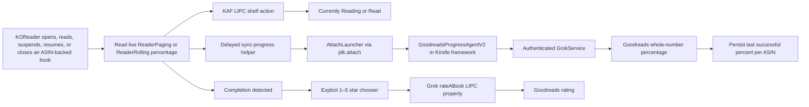

# Architecture

The plugin uses three native Kindle paths because Goodreads shelf state,
reading percentage, and ratings are not handled by one service.

## KOReader hook

`goodreads.koplugin/main.lua` uses normal ReaderUI events for periodic,
suspend/resume, and annotation telemetry. It also wraps `ReaderUI.onClose` so it
can capture the document path and live progress before the original close
handler unloads the document, then queues:

- the shelf action after one second;
- the percentage helper after three seconds;
- a one-time rating chooser after returning to the file browser when the book
  is complete.

The close hook resolves `reader.goodreads_native`, the active ReaderUI plugin
instance, rather than retaining the FileManager instance that installed the
global wrapper. This makes automatic behavior honor current menu settings.

Shell-level delays survive a complete KOReader exit and allow other close hooks
to finish writing the Kindle content database first. While a document is open,
`ReaderPaging:getLastPercent()` or `ReaderRolling:getLastPercent()` is the
authoritative source; persisted `percent_finished` is only a fallback.

## Shelf synchronization

The shelf path invokes `lipc-hash-prop` on the Kindle publisher
`com.lab126.kppkaf`, property `kppAddToGoodreadShelf`. Inputs are selected from
fixed actions and a strict ASIN allowlist.

## Rating synchronization

Ratings use `lipc-hash-prop` with publisher `com.lab126.grokservice` and
property `rateABook`. The payload contains a validated ASIN, a whole-number
rating from 0–5, `updateGoodreads = 1`, and a fixed origin. Rating 0 clears the
existing rating.

Completion only triggers the chooser. No rating is submitted until the reader
selects a value. Successful choices are stored in KOReader settings to suppress
repeat prompts; they can be changed or cleared manually at any time.

## Percentage synchronization

The percentage path cannot use that shelf property. `sync-progress` locates the
running Kindle framework JVM, serializes attachment with an atomic lock, and
loads a small Java agent through the JDK Attach API.

Inside the already-authenticated framework, the agent constructs a native
`PostShareProgressRequest`, sets the same headers as Amazon's reader-sharing
code, and invokes `GrokService.b(...)`. It logs only stage, HTTP status,
validity, and success—not the response body or session material.

HTTP 200 and 202 without a native error envelope count as success. Only then is
the integer written to
`/mnt/us/koreader/settings/goodreads_native_progress/<ASIN>`.

Before attachment, the plugin checks that state file and suppresses an already
accepted whole-number percentage.

## Diagnostics and annotations

The opt-in debug logger writes a strict allowlist of metadata fields to a
128 KiB rotating file. It does not accept arbitrary response or annotation
content. The on-device diagnostics view compares live reader progress, the
persisted success state, and the latest native agent result.

The KFX-to-EPUB converter preserves a text-free map of KFX PID, EID, EID
offset, length, and section metadata. Converted content elements carry their
EID and unambiguous base PID as `data-kfx-*` attributes. A batched helper walks
KOReader's normalized EPUB XPointer, counts Unicode characters from the nearest
KFX anchor, and emits the exact native short and long positions.

Before translation, the plugin collapses exact and endpoint-reversed duplicate
KOReader ranges and retains a non-empty note from either copy. The annotation
agent requires ReaderSDK's active book to match both the ASIN
and explicit native KFX path, reconciles highlight and note objects through
`AnnotationManager`, and notifies the KPP proxy. It
then reads the firmware's runtime feature flags. KSDK-enabled releases use the
KSDK annotation proxy; legacy releases create native `JournalingService`
entries for the exact active book and ask `WhisperSyncV1` to upload
them. The optional WhisperStore snapshot bridge is used only when enabled. A transient
payload carries note text. Ownership is transferred from KOReader's
root process to the framework JVM's dynamically resolved UID/GID, then the versioned agent removes it
immediately after loading, with bounded fallback cleanup by the helper; persistent plugin
state contains coordinate keys only. Diagnostics expose only counts and
sanitized success/failure stages. Requested POSIX modes are not a reliable
privacy boundary on Kindle's FUSE-backed `/mnt/us`; physical-storage and root
access are therefore in the same trust boundary while a snapshot is pending.
The agent closes and reopens the book before
reporting local verification. Before the agent write, the shell enables both
the legacy journal and KSDK shadow-mode lanes. After local, proxy, native
journal, and upload-request stages succeed, it invokes
`KSDKAnnotationsEnqueueForSync` and starts `com.lab126.whispersync`; a failed
trigger is retryable and is not reported as end-to-end success. Unsupported
paths are reported as `unavailable`, not successful. Only one native annotation request runs at a
time. Rapid edits for the same ASIN coalesce to the newest immutable snapshot,
while snapshots for other books remain queued. If the exact native book is not
active, the request is not mutated or accepted: its latest snapshot moves to a
root-only pending queue. One lock-protected watcher blocks on app manager
`appStarted` events and replays pending books when native KPP becomes active.
Transient native failures retry up to three times; a newer same-book snapshot
cancels an older retry.

Each shell reconciliation atomically replaces a text-free per-ASIN receipt in
`goodreads_native_sync_receipts`. Receipt transitions distinguish
`saved_locally`, `waiting_native`, `queued_amazon`, `failed`, and a manual
`discarded` state. They retain only counts, timestamps, bounded retry metadata,
agent generation, capability lane, and verification booleans. The
`cloud_observed` field remains `unavailable` unless a future independent
server-readback implementation verifies it; a native upload acknowledgement
alone cannot set it.

The receipt manager can replay an existing pending snapshot, remove only that
pending file after UI confirmation, or create a redacted support summary. The
summary enumerates books with local sequence labels rather than ASINs and does
not open pending payloads, preventing annotation text from entering support
artifacts. The helper requests restrictive modes, but `/mnt/us` is FUSE-backed
on Kindle and may not enforce POSIX mode bits; privacy comes from excluding
annotation text and identifiers from the exported summary.

## Upgrade behavior

The JVM may retain a previously loaded agent class and JAR path. Release agents
therefore use both a versioned class name and a versioned JAR filename.
Increment both whenever changing agent behavior that must take effect without
rebooting the Kindle framework.
