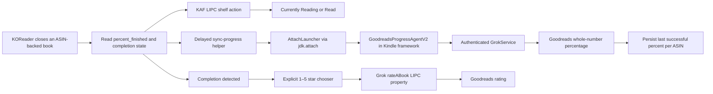

# Architecture

The plugin uses three native Kindle paths because Goodreads shelf state,
reading percentage, and ratings are not handled by one service.

## KOReader hook

`goodreads.koplugin/main.lua` wraps `ReaderUI.onClose`. It captures the document
path and progress before the original close handler runs, then queues:

- the shelf action after one second;
- the percentage helper after three seconds.
- a one-time rating chooser after returning to the file browser when the book
  is complete.

Shell-level delays survive a complete KOReader exit and allow other close hooks
to finish writing the Kindle content database first.

## Shelf synchronization

The shelf path invokes `lipc-hash-prop` on the Kindle publisher
`com.lab126.kppkaf`, property `kppAddToGoodreadShelf`. Inputs are selected from
fixed actions and a strict ASIN allowlist.

## Rating synchronization

Ratings use `lipc-hash-prop` with publisher `com.lab126.grokservice` and
property `rateABook`. The payload contains a validated ASIN, a whole-number
rating from 0–5, `updateGoodreads = 1`, and a fixed origin. Rating 0 clears the
existing rating.

Completion only triggers the chooser. No rating is submitted until the reader
selects a value. Successful choices are stored in KOReader settings to suppress
repeat prompts; they can be changed or cleared manually at any time.

## Percentage synchronization

The percentage path cannot use that shelf property. `sync-progress` locates the
running Kindle framework JVM, serializes attachment with an atomic lock, and
loads a small Java agent through the JDK Attach API.

Inside the already-authenticated framework, the agent constructs a native
`PostShareProgressRequest`, sets the same headers as Amazon's reader-sharing
code, and invokes `GrokService.b(...)`. It logs only stage, HTTP status,
validity, and success—not the response body or session material.

HTTP 200 and 202 without a native error envelope count as success. Only then is
the integer written to
`/mnt/us/koreader/settings/goodreads_native_progress/<ASIN>`.

## Upgrade behavior

The JVM may retain a previously loaded agent class and JAR path. Release agents
therefore use both a versioned class name and a versioned JAR filename.
Increment both whenever changing agent behavior that must take effect without
rebooting the Kindle framework.
