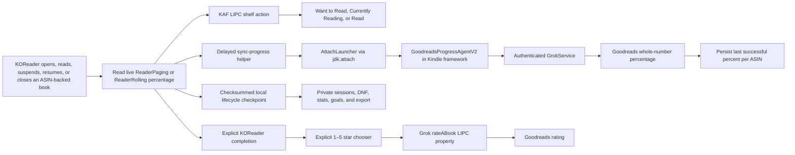

# Architecture

The plugin uses three native Kindle paths because Goodreads shelf state,
reading percentage, and ratings are not handled by one service.

## KOReader hook

`goodreads.koplugin/main.lua` uses normal ReaderUI events for periodic,
suspend/resume, and annotation telemetry. It also wraps `ReaderUI.onClose` so it
can capture the document path and live progress before the original close
handler unloads the document, then queues:

- the shelf action after one second;
- the percentage helper after three seconds;
- a one-time rating chooser after returning to the file browser when the book
  has KOReader's explicit complete status.

The close hook resolves `reader.goodreads_native`, the active ReaderUI plugin
instance, rather than retaining the FileManager instance that installed the
global wrapper. This makes automatic behavior honor current menu settings.

KFX annotation-position translation runs as a mode-0600 detached job. KOReader
polls an atomically renamed, coordinate-only result, so reader lifecycle hooks
do not wait for the ARM extractor. The private durable outbox remains
replayable if KOReader exits before that detached job finishes.

Shell-level delays survive a complete KOReader exit and allow other close hooks
to finish writing the Kindle content database first. While a document is open,
`ReaderPaging:getLastPercent()` or `ReaderRolling:getLastPercent()` is the
authoritative source; persisted `percent_finished` is only a fallback.

## Shelf synchronization

The shelf path invokes `lipc-hash-prop` on the Kindle publisher
`com.lab126.kppkaf`, property `kppAddToGoodreadShelf`. Inputs are selected from
the firmware's three fixed canonical actions and a strict ASIN allowlist.

Manual shelf selection validates the handler's returned current-shelf action
against the exact requested action. Substring matches are insufficient because
the native Read action is a prefix of Currently Reading. Only a confirmed
response creates the local receipt and explicit-choice override.

`shelfstate.lua` keeps at most 64 overrides. Each contains only the ASIN, fixed
native action, whole-number baseline percentage, and timestamp. An unchanged
checkpoint preserves the explicit choice. A changed percentage or a newly
completed book consumes it and resumes automatic shelf policy. Want to Read and
manual Read suppress percentage writes while their baseline remains unchanged.

## Rating synchronization

Ratings use `lipc-hash-prop` with publisher `com.lab126.grokservice` and
property `rateABook`. The payload contains a validated ASIN, a whole-number
rating from 0–5, `updateGoodreads = 1`, and a fixed origin. Rating 0 clears the
existing rating.

Completion only triggers the chooser. No rating is submitted until the reader
selects a value. Successful choices are stored in KOReader settings to suppress
repeat prompts; they can be changed or cleared manually at any time.

## Percentage synchronization

The percentage path cannot use that shelf property. `sync-progress` locates the
running Kindle framework JVM, serializes attachment with an atomic lock, and
loads a small Java agent through the JDK Attach API.

Inside the already-authenticated framework, the agent constructs a native
`PostShareProgressRequest`, sets the same headers as Amazon's reader-sharing
code, and invokes `GrokService.b(...)`. It logs only stage, HTTP status,
validity, and success—not the response body or session material.

HTTP 200 and 202 without a native error envelope count as success. Only then is
the integer written to
`/mnt/us/koreader/settings/goodreads_native_progress/<ASIN>`.

Before attachment, the plugin checks that state file and suppresses an already
accepted whole-number percentage.

## Private reading lifecycle

`readinghistory.lua` is a local state machine independent of Goodreads cloud
delivery. It tracks bounded first-read, reread, completed, and DNF sessions;
reading-day keys; and annual goals. Ninety-nine percent remains active. Only
KOReader's explicit complete status or a confirmed manual Read shelf action
can complete a session, and repeating Read is idempotent.

The deterministic state envelope carries a monotonic sequence and SHA-256.
Writes take a single-instance lock whose stale reaper is separately serialized.
Owner records and lifecycle inputs must be bounded regular non-symlink files;
missing, oversized, FIFO, or symlink owners are treated as busy or stale based
on the lock directory timestamp and are never opened as streams. Writes remove
only narrowly named interrupted temporaries, create replacements exclusively
with mode 0600, rotate one valid backup, and atomically rename a complete new
primary under `/var/local/koreader-goodreads-native`. A corrupt primary falls
back to the backup. If both are invalid, updates fail closed and preserve both
files.

State contains ASINs, timestamps, outcomes, percentages, and day keys only.
It excludes titles, authors, paths, annotation text, account data, device
identifiers, and authentication material. The explicit CSV/JSON export uses
the same constrained fields but is written under USB-visible `/mnt/us`; it is
local and is never evidence of Goodreads cloud delivery.

Firmware 5.19.5's mutable Goodreads library-book surface exposes the three
canonical shelves and rating, while percentage uses the separate native Grok
request. It does not expose writable DNF, lifecycle-date, reread, goal, or
statistics fields. Those lifecycle features therefore remain deliberately
local.

## Diagnostics and annotations

The opt-in debug logger writes a strict allowlist of metadata fields to a
128 KiB rotating file. It does not accept arbitrary response or annotation
content. The on-device diagnostics view compares live reader progress, the
persisted success state, and the latest native agent result.

The KFX-to-EPUB converter preserves a text-free map of KFX PID, EID, EID
offset, length, and section metadata. Converted content elements carry their
EID and unambiguous base PID as `data-kfx-*` attributes. A batched helper walks
KOReader's normalized EPUB XPointer, counts Unicode characters from the nearest
KFX anchor, and emits the exact native short and long positions.

Before translation, the plugin collapses exact and endpoint-reversed duplicate
KOReader ranges and retains a non-empty note from either copy. The annotation
snapshot is then atomically committed under `/var/local` before translation.
Its deterministic source envelope has a monotonic per-ASIN sequence and SHA-256
over normalized XPointer ranges and notes. The sequence high-water mark and a
valid existing snapshot jointly prevent rollback after an interrupted write.
On startup, one plugin instance verifies and resumes every surviving source
snapshot.

The annotation
agent requires ReaderSDK's active book to match both the ASIN
and explicit native KFX path, reconciles highlight and note objects through
`AnnotationManager`, and notifies the KPP proxy. It
then reads the firmware's runtime feature flags. KSDK-enabled releases use the
KSDK annotation proxy; legacy releases create native `JournalingService`
entries for the exact active book and ask `WhisperSyncV1` to upload
them. The optional WhisperStore snapshot bridge is used only when enabled. A transient
payload carries note text. Ownership is transferred from KOReader's
root process to the framework JVM's dynamically resolved UID/GID, then the versioned agent removes it
immediately after loading, with bounded fallback cleanup by the helper; persistent plugin
state contains coordinate keys only. Diagnostics expose only counts and
sanitized success/failure stages. Requested POSIX modes are not a reliable
privacy boundary on Kindle's FUSE-backed `/mnt/us`; source and translated
pending annotation payloads therefore live on root-only `/var/local` instead.
The agent closes and reopens the book before
reporting local verification. Before the agent write, the shell enables both
the legacy journal and KSDK shadow-mode lanes. After local, proxy, native
journal, and upload-request stages succeed, it invokes
`KSDKAnnotationsEnqueueForSync` and starts `com.lab126.whispersync`; a failed
trigger is retryable and is not reported as end-to-end success. Unsupported
paths are reported as `unavailable`, not successful. Only one native annotation request runs at a
time. Rapid edits for the same ASIN coalesce to the newest immutable snapshot,
while snapshots for other books remain queued. If the exact native book is not
active, the request is not mutated or accepted: its latest snapshot moves to a
root-only pending queue. One lock-protected watcher blocks on app manager
`appStarted` events and replays pending books when native KPP becomes active.
Transient native failures retry up to three times; a newer same-book snapshot
cancels an older retry. After full native verification and queue acceptance,
the helper atomically renames the source outbox entry and deletes it only if its
sequence and checksum still match the completed request. If a newer source won
the race, it is restored or left in place and the older operation cannot report
outbox acknowledgement.

Each shell reconciliation atomically replaces a text-free per-ASIN receipt in
`goodreads_native_sync_receipts`. Receipt transitions distinguish
`saved_locally`, `waiting_native`, `queued_amazon`, `failed`, and a manual
`discarded` state. They retain only counts, timestamps, bounded retry metadata,
agent generation, capability lane, and verification booleans. The
`cloud_observed` field remains `unavailable` unless a future independent
server-readback implementation verifies it; a native upload acknowledgement
alone cannot set it.

The receipt manager can replay an existing pending snapshot, remove only that
pending file after UI confirmation, or create a redacted support summary. The
summary enumerates books with local sequence labels rather than ASINs and does
not open pending payloads, preventing annotation text from entering support
artifacts. The helper requests restrictive modes, but `/mnt/us` is FUSE-backed
on Kindle and may not enforce POSIX mode bits; privacy comes from excluding
annotation text and identifiers from the exported summary.

## Experimental native annotation import

A singleton `lipc-wait-event` watcher captures a read-only snapshot while the
native reader owns the active local `/mnt/us/documents` book. The exporter
performs no ReaderSDK write, KPP notification, journal entry, or sync request.
Its private result is atomically moved into a root-only native-import inbox.
The exporter emits `snapshot_complete=true` only after the entire bounded list
has been serialized. Destructive reconciliation and tombstone acknowledgement
require that attestation; `success=true` alone is insufficient.

When the matching converted book next opens or resumes, KOReader runs
`kindle-helper translate-native-positions` as a detached batch job. Verified
XPointers merge through `ReaderAnnotation:addItem` and one
`AnnotationsModified` event. Component-level provenance distinguishes a
native-created highlight from an imported note attached to a pre-existing
KOReader highlight. Complete snapshots can therefore reconcile native note
edits, note removal, and safe highlight deletion.

A native-created highlight is deleted only if its note and style still match
the imported baseline. A local note edit wins over stale snapshots and protects
the highlight; an exact native echo rebases the baseline and restores normal
two-way ownership. A local style change detaches highlight ownership. For a
pre-existing KOReader highlight, only an unchanged imported note may be removed.
Ambiguous v0.7 markers are detached without deletion. The snapshot is removed
only after the persistence event succeeds; failed events retain an in-memory
replay record and the root-only snapshot. The private note baseline exists only
in KOReader's own metadata and is excluded from logs and receipts.

ReaderReady, resume, suspend, close, manual sync, and recovered outboxes all
respect one ordering invariant: a pending native snapshot for a book must be
resolved before any outbound snapshot for that book can run. Native-import
persistence events are origin-guarded, then one converged full-state snapshot
is captured so genuine KOReader-only annotations still travel outward. Invalid,
mismatched, or failed imports remain pending and block stale outbound deletion.

An official KOReader removal event for a provenance-bearing highlight records
a bounded coordinate-only tombstone in plugin settings. A stale complete native
snapshot containing that key is suppressed rather than re-imported. A later
complete snapshot that omits the key acknowledges and removes the tombstone.
No selected text or note content enters this deletion ledger.

## SSH-safe doctor

`bin/goodreads-doctor` is a read-only, fixed-schema process and installation
check. It walks `/proc` to distinguish one nested KOReader process tree from
multiple independent roots, checks only exact runtime/agent prerequisites, and
counts private queue files without opening or naming them. It never invokes a
reader launcher, LIPC mutation, signal, reboot, or network operation. Warnings
exit `1`; hard integrity/single-instance failures exit `2`.

## Upgrade behavior

The JVM may retain a previously loaded agent class and JAR path. Release agents
therefore use both a versioned class name and a versioned JAR filename.
Increment both whenever changing agent behavior that must take effect without
rebooting the Kindle framework.
